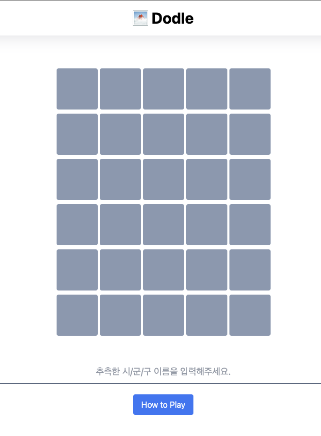
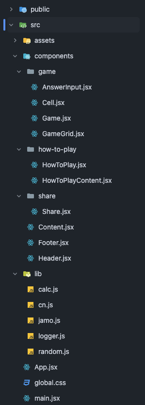

# 리액트 스터디 2주차 - 리액트 복습 + 미니 사이드 프로젝트
이번 주는 지난주에 배운 리액트의 기본 문법을 복습하고, 리액트로 간단한 사이드 프로젝트를 해보았습니다. 리액트 문법으로는 비동기 처리에 중요한 async와 await 키워드를 알게 되었고, React Router로 링크를 만드는 방법도 알게되었습니다.

<br>

사이드 프로젝트로는 [**도들**](https://dodle.vercel.app/)이라는 한국의 도시 이름을 맞추는 워들 게임을 만들어봤습니다.

<br>

1. [**`async`-`await` 비동기 문법**](#async-await-비동기-문법)
    1. [`async-await`의 사용 방법](#1-async-await의-사용-방법)
    2. [fetch와 함께 사용하기](#2-fetch와-함께-사용하기)
2. [**React Router와 `Link`**](#react-router와-link)
    1. [라우터 설정하기](#1-라우터-설정하기)
    2. [`Link` 컴포넌트 사용하기](#2-link-컴포넌트-사용하기)
3. [다이나믹 URL](#다이나믹-url)
    1. [`useParams` 훅 사용하기](#1-useparams-훅-사용하기)
    2. [동적 라우팅 처리](#2-동적-라우팅-처리)
4. [사이드 프로젝트 도들](#사이드-프로젝트---도들)
    1. [만들면서 배운 것](#1-만들면서-배운-것)
    2. [사용한 기술 스택들에 관한 이야기](#2-사용한-기술-스택에-관한-이야기)

<hr>

## `async`-`await` 비동기 문법

``` jsx
import { useParams } from "react-router-dom";
import { useEffect } from "react";

function Detail() {
  const { id } = useParams();

  useEffect(() => {
    const getMovie = async () => {
      const json = await (
        await fetch(`https://yts.mx/api/v2/movie_details.json?movie_id=${id}`)
      ).json();
      console.log(json);
    };
    getMovie();
  }, [id]);

  return <h1>Detail</h1>;
}
export default Detail;
```
> 배운 것들
> - async-await의 사용 방법
> - fetch와 함께 사용하기

<br>

### 1. `async`-`await`의 사용 방법

`async`와 `await`는 자바스크립트의 비동기 처리를 보다 간결하고 읽기 쉽게 해주는 문법입니다. `async` 키워드는 함수 앞에 붙여서 해당 함수가 비동기 함수임을 나타내며, 함수 내부에서 `await` 키워드를 사용하여 프로미스의 완료를 기다릴 수 있습니다.

```jsx
const getData = async () => {
  const response = await fetch("API_URL");
  const data = await response.json();
  return data;
};
```

위 코드에서 `getData` 함수는 `async`로 선언되었으며, `await` 키워드를 사용하여 `fetch`와 `response.json()`의 완료를 기다립니다.

<br>

#### 왜 쓰는가

기존의 비동기 처리는 `.then()` 체인을 사용하여 콜백 지옥이 발생하거나 코드의 가독성이 떨어지는 경우가 있었습니다. `async`-`await`를 사용하면 동기 코드처럼 비동기 코드를 작성할 수 있어 가독성이 향상되고, 오류 처리도 더 간편해집니다.

<br>

### 2. `fetch`와 함께 사용하기
`fetch API`는 네트워크 요청을 보내는 비동기 함수로, `promise`를 반환합니다. 이를 `async-await`와 함께 사용하면 네트워크 요청의 결과를 보다 직관적으로 처리할 수 있습니다.

```jsx
useEffect(() => {
  const getMovie = async () => {
    const json = await (
      await fetch(`https://yts.mx/api/v2/movie_details.json?movie_id=${id}`)
    ).json();
    console.log(json);
  };
  getMovie();
}, [id]);
```

위 코드에서는 `useEffect` 훅 내부에 `getMovie`라는 비동기 함수를 선언하고 즉시 호출합니다. `fetch`로 API 요청을 보내고, 그 결과를 `await`로 받아옵니다. 이렇게 하면 API 응답을 받아올 때까지 다음 코드의 실행을 잠시 중단하고, 응답을 받은 후에 `json()` 메서드를 사용하여 JSON 데이터를 파싱합니다.

<br>

## React Router와 Link

```jsx
import { BrowserRouter as Router, Switch, Route } from "react-router-dom";
import Detail from "./routes/Detail";
import Home from "./routes/Home";

function App() {
  return (
    <Router>
      <Switch>
        <Route path="/hello">
          <h1>Hello</h1>
        </Route>
        <Route path="/movie/:id">
          <Detail />
        </Route>
        <Route path="/">
          <Home />
        </Route>
      </Switch>
    </Router>
  );
}

export default App;
```
> 배운 것들
> - 라우터 설정하기
> - Link 컴포넌트 사용하기

<br>

### 1. 라우터 설정하기

`React Router`는 `SPA(Single Page Application)`에서 페이지 라우팅을 처리하기 위한 라이브러리입니다. `BrowserRouter`, `Switch`, `Route` 컴포넌트를 사용하여 라우팅을 설정합니다.

```jsx
import { BrowserRouter as Router, Switch, Route } from "react-router-dom";

function App() {
  return (
    <Router>
      <Switch>
        <Route path="/path">
          <Component />
        </Route>
      </Switch>
    </Router>
  );
}
```

<br>

#### 왜 쓰는가
SPA에서는 **페이지 전환 시 전체 페이지를 다시 로드하지 않고**도 URL에 따라 컴포넌트를 바꿔줄 수 있습니다. React Router를 사용하면 이러한 라우팅을 간편하게 구현할 수 있으며, 사용자 경험을 향상시킬 수 있습니다.

<br>

### 2. Link 컴포넌트 사용하기
React Router에서 페이지 간 이동을 위해 `<a>` 태그 대신 `<Link>` 컴포넌트를 사용합니다. 이는 페이지 전체를 다시 로드하지 않고도 URL을 변경하고, 해당 컴포넌트를 렌더링할 수 있게 해줍니다.

```jsx
import { Link } from "react-router-dom";

function Home() {
  return (
    <div>
      <h1>Home</h1>
      <Link to="/movie/1">Go to Movie 1</Link>
    </div>
  );
}
```
위 코드에서는 `to` 속성을 사용하여 이동할 경로를 지정합니다.

<br>

### 다이나믹 URL

```jsx
import { useParams } from "react-router-dom";
import { useEffect } from "react";

function Detail() {
  const { id } = useParams();

  useEffect(() => {
    const getMovie = async () => {
      const json = await (
        await fetch(`https://yts.mx/api/v2/movie_details.json?movie_id=${id}`)
      ).json();
      console.log(json);
    };
    getMovie();
  }, [id]);

  return <h1>Detail</h1>;
}
export default Detail;
```
> 배운 것들
> - `useParams` 훅 사용하기
> - 동적 라우팅 처리

<br>

### 1. `useParams` 훅 사용하기

```jsx
import { useParams } from "react-router-dom";

function Detail() {
  const { id } = useParams();
  // id를 사용하여 로직 처리
}
```

`useParams` 훅은 현재 URL의 파라미터를 객체 형태로 반환합니다. 이를 통해 동적으로 변하는 URL의 일부를 받아와 컴포넌트에서 사용할 수 있습니다.

<br>

#### 왜 쓰는가
동적 라우팅을 구현할 때 URL의 일부를 변수처럼 사용하여 각기 다른 데이터를 보여줄 필요가 있습니다. useParams를 사용하면 URL에서 필요한 파라미터를 손쉽게 추출할 수 있습니다.

<br>

### 2. 동적 라우팅 처리

동적 라우팅은 URL의 특정 부분이 변수로 취급되어 다양한 페이지를 렌더링할 수 있게 합니다. React Router에서는 `Route` 컴포넌트의 `path` 속성에서 콜론(`:`)을 사용하여 이를 구현합니다.

```jsx
<Router>
  <Switch>
    <Route path="/movie/:id">
      <Detail />
    </Route>
  </Switch>
</Router>
```
위 코드에서는 `/movie/:id` 경로로 들어올 때마다 `Detail` 컴포넌트를 렌더링하며, `id` 파라미터를 받아옵니다.

<br>

## 사이드 프로젝트 - 도들


https://dodle.vercel.app/

도들(dodle)은 `한국의 시/군/구`를 맞추는 워들 게임이다. 매일 자정 답이 바뀌며 6번의 추리 기회를 통해 정답을 맞춘 뒤 어떻게 풀었는지 공유할 수 있는 것이 특징이다.

```
Dodle 결과 #3
https://dodle.vercel.app/
⬜⬜🟩🟨⬜
⬜🟨⬜⬜⬜
🟩⬜🟩🟩🟩
🟩🟩🟩🟩🟩
```

### 1. 만들면서 배운 것

이 프로젝트를 만들며 리액트의 여러 특성들을 이해하게 되었다. 특히 `useState()`로 상태를 관리하고, 각 기능들을 컴포넌트로 쪼갠 뒤 Props를 통해 정보를 주는 경험을 많이 하게 되었다.



코드가 복잡해 질수록 하나의 `.jsx` 파일에 작성하는 것이 아닌 컴포넌트로 쪼개서 관리하는 것이 더욱 편했다. 하지만 이 경우 `props`들이 복잡해져서 약간의 난항을 겪었다. `PropTypes`라는 라이브러리나 `TypeScript`를 사용하는 이유를 알 것 같았다. 

### 2. 사용한 기술 스택에 관한 이야기
#### Vite
리액트 프로젝트를 만들 때 전에는 `Create-React-App`이라는 것을 사용했다. 강의에서 그렇게 알려주었기 때문이다. 이번 사이드프로젝트를 해보며 그대로 `CRA`를 사용하려 했으나 유튜브 영상을 통해 `Vite`라는 빌드 툴을 알게 되었다. `Vite`를 사용해본 후기로는 기존 `CRA`보다 속도가 정말정말정말 빠르다는것이다. 호스팅은 `Vercel`로 했는데, 깃허브에 커밋 한 변경사항이 약 10초 뒤쯤 빌드가 완료되어 `Vercel`에 반영되어 있었다. 해커톤이나 또다른 사이드 프로젝트를 진행할 때 팀원이 `CRA`를 쓰려한다면 `Vite`를 꼭 권하고 싶다.

<br>

#### TailWindCSS
`tailwindcss`는 별도의 `css`파일 없이 `html`의 `class`명에 스타일 요소를 입력하면, 그것을 인식해 스타일을 적용해주는 `스타일 프레임워크`이다.

```jsx
export default function Header() {
  return (
    <header
      className="flex justify-center mb-10 md:mb-16 py-4"
      style={{
        boxShadow: "0px 4px 29px 0px rgba(66, 68, 90, 0.14)",
      }}
    >
      <p className="text-3xl font-bold select-none">🌁 Dodle</p>
    </header>
  );
}

```

위의 코드를 보면 `<header>` 태그의 `className`(JS의 경우 `class`라는 키워드가 이미 있어서, 리액트에서는 `className`이라고 한다)에 굉장히 긴 문자열이 있다. 위의 문자열이 `tailwindcss`로 만든 스타일이다. 별도의 css 파일 없이 `className`에 작성하기만 하면 적용이 되어서 React에서 사용하기 굉장히 편리했다. 

다만, 기존 css문법도 숙지가 잘 안되어 있었는데, `tailwindcss`를 써보려니 헷갈리거나 구글링 시간이 오래걸리는 등 러닝커브가 좀 있었다. 그래도 한번 감을 잡고 나니, 사용이 편리하고 스타일을 작성하는 시간도 상당히 줄어들은 것 같다.